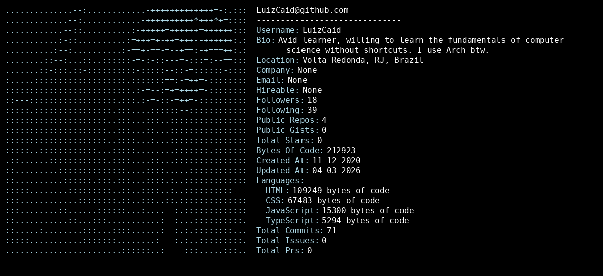

<h1> Hi there! I'm Luiz Caid. </h1>

<table align="center" border="0">
  <tr>
    <!-- Lado Esquerdo: Neofetch -->
    <td valign="center">
      
    </td>
    <!-- Lado Direito: GIF -->
    <td valign="center">
      
    </td>
  </tr>
</table>

  

  
  
  
  
  
  
  
  
  
  
  

